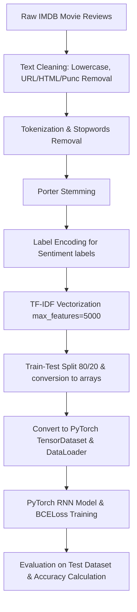

# 🎬 SentimentRNN: Classifying IMDB Movie Reviews with Recurrent Neural Networks

[](https://www.python.org/)
[](https://pytorch.org/)
[](https://www.nltk.org/)
[](https://scikit-learn.org/)
[](https://opensource.org/licenses/MIT)

An end-to-end natural language processing (NLP) and deep learning project built to classify movie reviews into positive or negative sentiments using the IMDB dataset. I designed, preprocessed, and trained a PyTorch-based Recurrent Neural Network (RNN) that achieves **86.86% accuracy** on unseen test data—demonstrating text mining, cleaning, TF-IDF vectorization, PyTorch DataLoader creation, and RNN architecture design.

---

## 🔍 The Pipeline & Modeling Workflow

The project follows a standard NLP and PyTorch modeling workflow, from raw review cleaning to evaluation. Here is the general structure:



### Behind the Scenes: How the Pipeline is Built

To get the raw movie review text ready for the RNN model, I built a structured preprocessing pipeline:

* **Cleaning the noise**: I removed HTML tags (using `<.*?>` regex) and URLs since they don't contain sentiment signals. I also converted all text to lowercase and stripped punctuation to prevent words like "Awesome" and "awesome!" from being treated as different tokens.
* **Tokenizing and Stopwords**: I tokenized the reviews into words using NLTK and removed standard English stopwords. This trimmed down the vocabulary size significantly, allowing the model to focus on the words that actually convey sentiment.
* **Stemming**: I applied the PorterStemmer to reduce words to their base forms (e.g., "watching", "watched", and "watch" all map to "watch"). This helps in vocabulary consolidation.
* **Vectorization**: I vectorized the clean reviews using `TfidfVectorizer(max_features=5000)`. This selected the top 5,000 most informative terms based on term frequency-inverse document frequency, creating a dense numerical input representation.
* **Batching with PyTorch**: I converted the dense feature matrices into PyTorch FloatTensors and loaded them using `DataLoader` with a batch size of `64`, enabling shuffling for the training set.

---

## 🏗️ Neural Network Architecture & Training

I built a Recurrent Neural Network (RNN) using PyTorch's `nn.Module` with the following layers:

* **Input Preparation**: Since PyTorch's `nn.RNN` expects a 3D tensor representing `(batch_size, sequence_length, input_size)`, I reshaped each batch of features from `(64, 5000)` to `(64, 1, 5000)` using `unsqueeze(1)`.
* **Recurrent Layer**: A standard `nn.RNN` layer that accepts our 5000-dimensional TF-IDF vectors. It uses a hidden size of `128` and a single recurrent layer.
* **Fully Connected Block**: I fetched the hidden state of the last timestep (`out[:, -1, :]`) and passed it through a linear layer (`nn.Linear`) mapping to a single output logit.
* **Loss & Optimizer**: I used PyTorch's `BCELoss` (Binary Cross-Entropy Loss) paired with the `Adam` optimizer to train the model weights.

---

## 📊 Model Evaluation & Results

Here are the training and testing metrics I recorded from the model run:

### Training Loss Progression

During training, I ran the optimization loop for **10 epochs**. The average training loss per batch steadily converged:

| Epoch | Training Loss (Average per Batch) |
| :--- | :---: |
| **Epoch 1** | 0.345627 |
| **Epoch 2** | 0.236212 |
| **Epoch 3** | 0.220270 |
| **Epoch 4** | 0.213566 |
| **Epoch 5** | 0.208945 |
| **Epoch 6** | 0.206026 |
| **Epoch 7** | 0.203690 |
| **Epoch 8** | 0.201710 |
| **Epoch 9** | 0.201018 |
| **Epoch 10** | **0.199459** |

### Testing Results (Unseen Data)

* **Total Samples Evaluated**: 9,917
* **Correct Predictions**: 8,614
* **Accuracy Score**: **86.86%**

### 💡 What the numbers tell us

* **TF-IDF provides a solid signal**: A test accuracy of **86.86%** is a very strong result for a simple single-layer RNN trained on TF-IDF vectors. Since a random guess yields 50% accuracy on binary classification, the network successfully learned to associate key vocabulary terms with positive or negative sentiment.
* **Simple RNN Limitation**: Because the sequence length is set to 1 (`unsqueeze(1)`), the RNN isn't looping over long sequential steps. Instead, it processes the entire vocabulary footprint in a single recurrent step. This means it acts similarly to a feedforward layer, but converges quickly and serves as a solid baseline.
* **Clear Convergence**: The training loss dropped smoothly from 0.3456 down to 0.1995, confirming that the Adam optimizer worked perfectly to minimize our binary cross-entropy loss.

---

## 🚀 Next Steps: How I'd Take This Further

If I had more time or were preparing this model for a production-grade NLP pipeline, here are the 5 strategies I would implement to push performance even higher:

1. **Switch to Dense Word Embeddings**: Currently, I'm using TF-IDF representation which ignores word order. I would replace TF-IDF with token-index sequences and a trainable `nn.Embedding` layer (or pre-trained GloVe/Word2Vec embeddings) to represent words as dense vectors.
2. **Leverage Sequence Context with LSTM/GRU**: Simple RNN cells suffer from vanishing gradients. I would upgrade the recurrent block to an LSTM or GRU and use the actual word sequence length (e.g., sequence length of 100 or 200 words) instead of a sequence length of 1. This would allow the model to learn actual word dependencies and context (e.g., handling negations like "not good").
3. **Add Regularization**: To avoid overfitting and stabilize the loss, I'd introduce `nn.Dropout` after the recurrent layer and use Batch or Layer Normalization.
4. **Transfer Learning with Transformers**: Fine-tuning a pre-trained transformer model like **DistilBERT** or **RoBERTa** would easily push the classification accuracy above 93%, since they are trained on massive corpora and understand complex semantics, negation, and sarcasm.
5. **Cross-Validation & Hyperparameter Tuning**: I'd implement 5-fold cross-validation to get more stable performance metrics and use `Optuna` to tune hidden size, learning rate, and batch size.

---

## 🛠️ How to Run the Project Locally

If you want to pull this down and run the notebook on your local machine, here is the quick-start guide:

### 1. Clone and Navigate
```bash
git clone <repository-url>
cd Recurrent_Neural_Network-IMDB_Movie_Reviews_Sentiment_Analysis
```

### 2. Spin Up a Virtual Environment
* **On Windows (PowerShell):**
  ```powershell
  python -m venv .venv
  .venv\Scripts\Activate.ps1
  ```
* **On macOS/Linux:**
  ```bash
  python3 -m venv .venv
  source .venv/bin/activate
  ```

### 3. Select Python Interpreter
In your IDE (e.g., VS Code), select the Python interpreter pointing to the virtual environment:
* Windows: `.venv\Scripts\python.exe`
* macOS/Linux: `.venv/bin/python`

### 4. Install the Packages
```bash
pip install pandas numpy scikit-learn nltk torch jupyter
```

### 5. Start the Notebook
```bash
jupyter notebook
```
Open `RNN_IMDB_Movie_Reviews_Sentiment_Analysis.ipynb` and run all cells.
